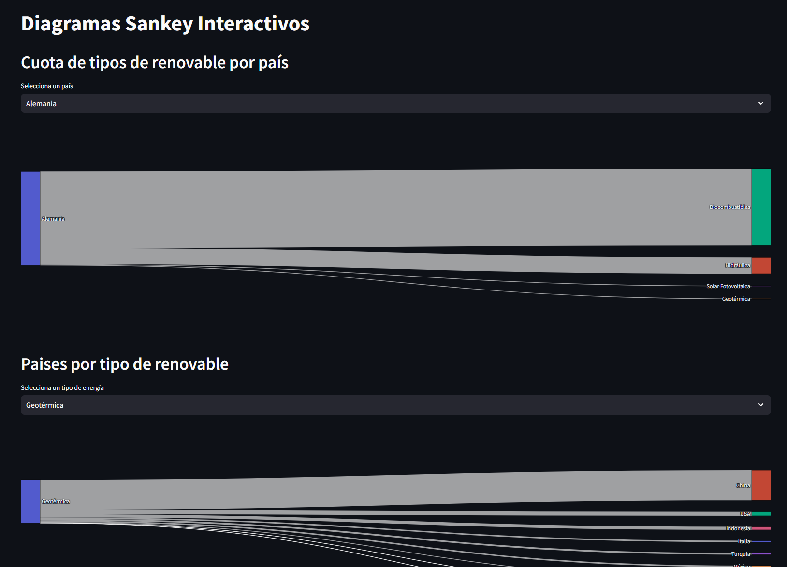

# Análisis energía

## Un vistazo al consumo de energía mundial con la ayuda de Python & Streamlit

**En este proyecto se analiza el consumo mundial de energía** por medio de diversas gráficas, preferentemente de tipo **Sankey**.

**Mi interés por este tema vino a raíz del inicio de la guerra de Ucrania** y la subida consiguiente de los precios de la energía. En aquella época había incertidumbre sobre este asunto, y me preguntaba a que países podía afectar en mayor medida esta situación.

**Es un trabajo en curso** al que dedicaré tiempo a ratos, cuando pueda, con el propósito de mejorar lo que puede ofrecer. Asimismo es un trabajo de práctica, para adquirir mayor nivel en el uso de **streamlit**, una librería de **python** que me gusta y que quiero usar mas en el futuro.

**La fuente de datos está sacada de Kaggle**, pero seguiré indagando para ver si encuentro datos mas completos.

Puedes encontrar una demo de este proyecto en la web oficial de Streamlit.
[**energiamundial**](https://energiamundial.streamlit.app/)
# 

 

## Autor

[**Victor Barahona - Egokitek (cuenta en Github)**](https://github.com/Egokitek)

[**www.victorbarahona.com**](http://www.victorbarahona.com)

## Licencia

**GPL3.0**

## En desarrollo 

- Confirmar la veracidad y precisión de los datos empleados
- ampliar la elección de gráficas y datos a analizar

